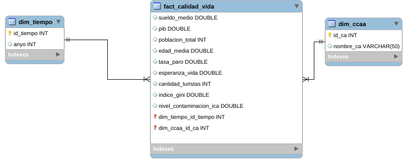
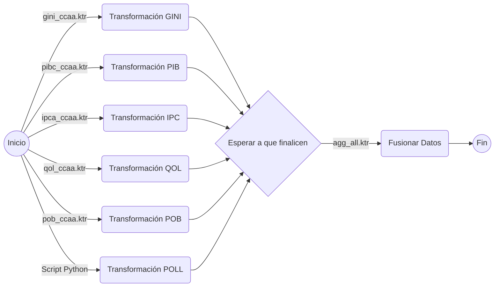
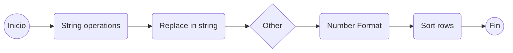
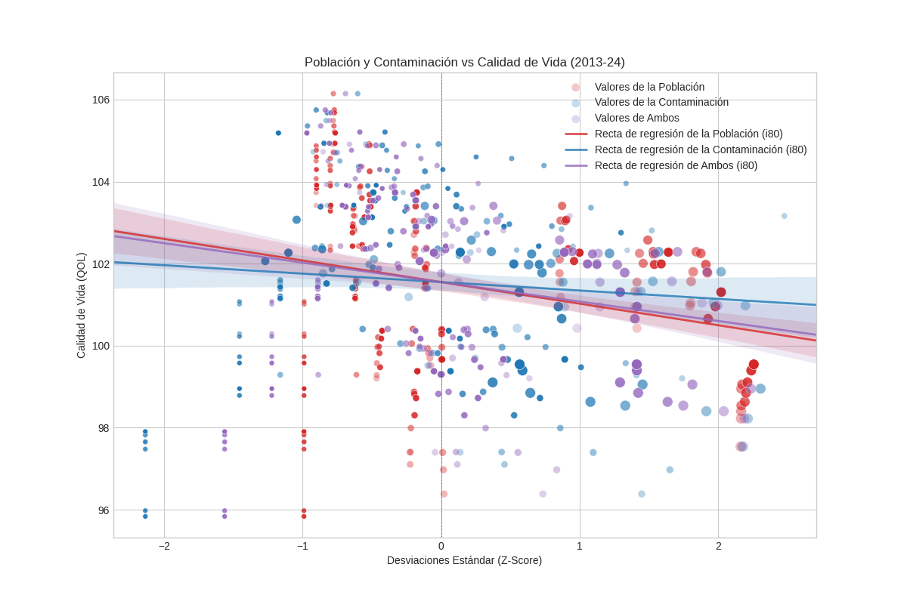
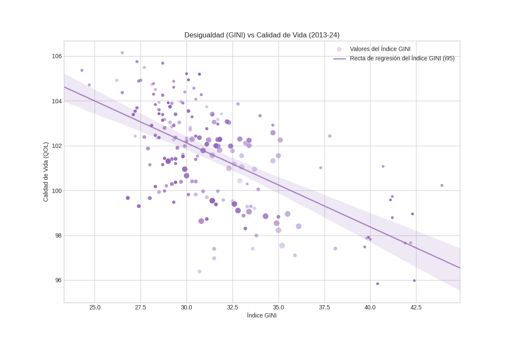
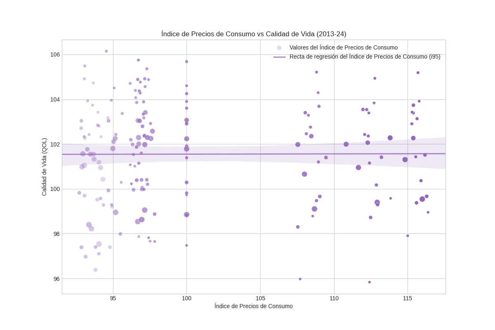
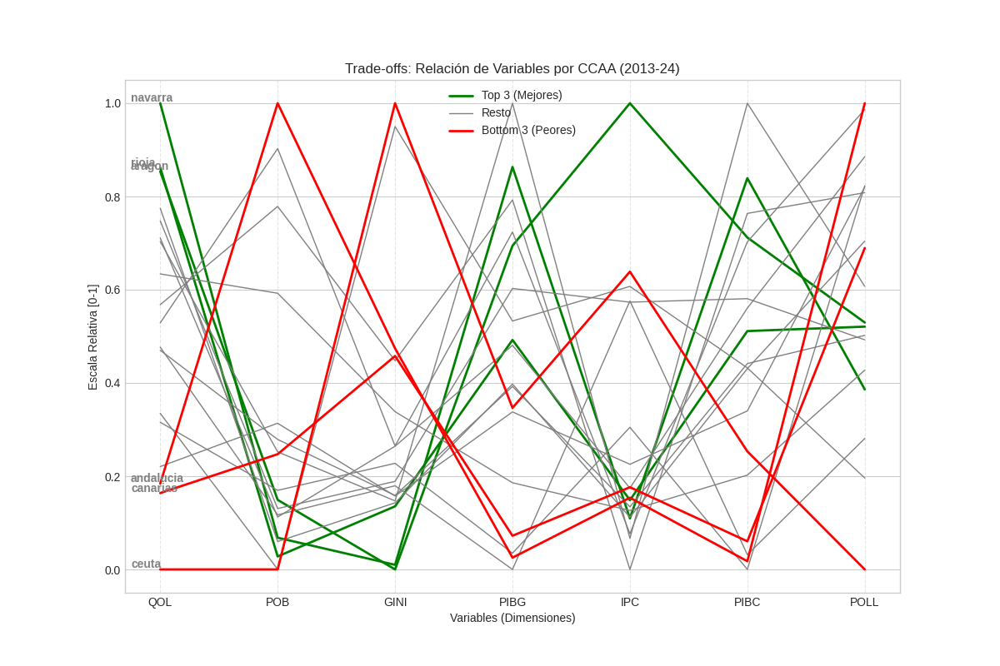
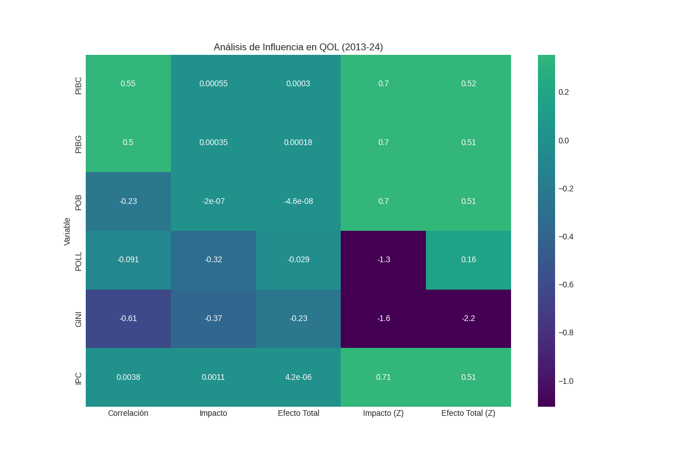

# Adquisición y Preparación de Datos

## Índice

- [Equipo](#equipo)
- [Apartados](#apartados)
- [Estructura del Repositorio](#estructura-del-repositorio)
1. [Temática y Preguntas](#temática-y-preguntas)
2. [Obtención de Datos Relevantes](#obtención-de-datos-relevantes)
3. [Almacén de Datos](#almacén-de-datos)
4. [Transformación y Limpieza](#transformación-y-limpieza)
5. [Transformación a Tripletas](#transformación-a-tripletas)
6. [Visualizaciones](#visualizaciones)
7. [Documentación y Memoria](#documentación-y-memoria)

## Equipo (G3)

- Carlos Salas - [Gh](https://github.com/csalas-alarcon)
- David Muñoz - [Gh](https://github.com/oppangangnamsta)
- Linxi Jiang - [Gh](https://github.com/Linxi-Jiang)
- Stefano Bia - [Gh](https://github.com/Stefano-UA)

## Apartados

1. - [X] Temática y Preguntas
2. - [ ] Obtención de Datos
3. - [ ] Diseño Conceptual, Lógico y Físico
4. - [ ] Extracción y Preparación de Datos (pentaho)
5. - [ ] Transformación de Datos (tripletas)
6. - [ ] Visualizaciones
7. - [ ] Memoria del Trabajo
8. - [ ] Repositorio GitHub

### Revisiones

Aquí tenemos indicadas las revisiones realizadas para cada apartado por cada miembro del equipo.
Las casillas **marcadas** con una *X* indican que ese miembro del equipo le ha dado su **visto bueno** a ese apartado.

| Apartado | Salas | David | Linxi | Stefano |
|:-:|:---:|:---:|:---:|:---:|
| 1 | (X) | (X) | (X) | (X) |
| 2 | (X) | ( ) | (X) | (X) |
| 3 | (X) | ( ) | (X) | (X) |
| 4 | (X) | ( ) | (X) | (X) |
| 5 | ( ) | ( ) | ( ) | (X) |
| 6 | (X) | ( ) | (X) | (X) |
| 7 | ( ) | ( ) | ( ) | ( ) |
| 8 | ( ) | ( ) | ( ) | (X) |

## Estructura del Repositorio

- ./**data**: Datos obtenidos
    - /**pollution**: Datos de sensores de contaminación del aire por CCAA
    - /*gini_ccaa.csv*: Índice de desigualdad GINI por CCAA
    - /*ipc_ccaa.csv*: Índice de Precios de Consumo por CCAA
    - /*pibc_ccaa.csv*: Producto Interior Bruto per cápita por CCAA
    - /*pob_ccaa.csv*: Cantidad de población por CCAA
    - /*pob_ccaa_ex.csv*: Cantidad de población por CCAA con menos años
    - /*qol_ccaa.xslx*: Índice de calidad de vida por CCAA
    - /*qol_ccaa_ex.xslx*: Índice de calidad de vida por CCAA con datos extra
- ./**design**: Diseños del almacén de datos
    - /*conceptual.md*: Diseño conceptual
    - /*logic.png*: Diseño lógico
    - /*logic.mwb*: Diseño lógico (modelo de MySQL Workbench)
    - /*physic.sql*: Diseño físico
- ./**dist**: Distintos ficheros y datos finales
    - /**kettle**: Agregados generados por las transformaciones de Pentaho y Python
    - /**web**: Directorio con la página web generada (autocontenido)
    - /*data.csv*: Agregado de datos final
- ./**docs**: Documentación del trabajo
    - /*Presentation.pdf*: Presentación del trabajo
    - /*Memoria.pdf*: Memoria del trabajo
    - /*Memoria.odt*: Memoria del trabajo
- ./**kettle**: Trabajos y transformaciones
    - /**pollution**: Trabajos y transformaciones de pollution hechos en Python
    - /**steps**: Transformaciones de Pentaho para cada uno de los CSV de entrada
    - /*agg_all.ktr*: Transformación de Pentaho para agregar todos los CSV limpios en uno final
    - /*data.kjb*: Trabajo de Pentaho que orquesta todo el proceso de limpieza, transformación y agregación de datos
- ./**pdi** Contiene una copia de [Pentaho Data Integration](https://pentaho.com/products/pentaho-data-integration/)
- ./**schema**: Definiciones RDF
    - /**code**: Código para generar las definiciones RDF
    - /*.ttl*: Definiciones RDF para cada categoría
- ./**visuals**: Visualizaciones de datos
    - /**extended**: Visualizaciones interactivas generadas con datos enriquecidos con Wikidata
    - /**code**: Código para generar las visualizaciones
    - /*.png*: Visualizaciones
- ./**web**: Generación de página web para las visualizaciones
    - /*build.sh*: Script encargado de generar la página web
    - /*style.css*: Hoja de estilos de la página web
    - /*.html*: Snippets de HTML que forman la página web

- *start.sh*: Script para ejecutar las transformaciones, generar las tripletas, generar las visualizaciones y generar la página web de las visualizaciones

> [!IMPORTANT]
> **DISCLAIMER:** Se incluyen los binarios de **Pentaho Data Integration (PDI)** únicamente para asegurar la reproducibilidad del ETL sin configuraciones externas. La propiedad intelectual del software pertenece íntegramente a **Hitachi Vantara**.

> [!WARNING]
> Ejecutar *./start.sh* sobrescribe algunos ficheros que se encuentran en las carpetas *./dist*, *./schema* y *./visual*.

## Temática y Preguntas

- **Temática**: Calidad de Vida (*QOL*)
- **Lienzo del problema**:
    - *Who*: Los habitantes de las CCAA estudiadas y sus respectivas administraciones públicas.
    - *What*: Determinar la influencia estadística real de factores económicos, sociales y ambientales en la Calidad de Vida.
    - *Where*: En las diferentes CCAA de España durante los últimos 12 años aproximadamente.
    - *Why*: Optimizar la toma de decisiones identificando qué variables afectan más a la calidad de vida real.
- **Objetivos**:
    - Cuantificar la correlación y la magnitud del impacto de las variables macroeconómicas (PIB, IPC), sociales (GINI) y ambientales (Contaminación) sobre el Índice de Calidad de Vida (QOL).
- **Casos de uso**:
    - Soporte a la decisión en políticas públicas: Sirve de diagnóstico para administraciones ya que permite priorizar las inversiones y maximizar así el impacto de las mismas.
    - Benchmarking competitivo entre CCAA: Sirve como análisis comparativo para evaluar la evolución relativa de una CCAA frente a las demás. Esto permite evaluar la gestión de cada CCAA respecto al resto y así copiar las estrategias que hayan tenido más éxito y descartar las que hayan tenido menos.
- **Métricas Clave**:
    - *QOL*: Índice de Calidad de Vida -> Sobre lo que se va a realizar el estudio.
    - *PIB y IPC*: Variables macroeconómicas -> Sobre lo que se va a medir el impacto.
    - *GINI*: Índice de Desigualdad -> Sobre lo que se va a medir el impacto.
    - *Contaminación*: Índice de toxicidad acumulada en el aire -> Sobre lo que se va a medir el impacto.
    - *Poblaciones*: Cantidad de habitantes -> No es una métrica clave pero es bastante relevante y también se puede medir su impacto.
- **Preguntas**:
    - ¿Cómo influye la economía de una CCAA en la calidad de vida de sus habitantes?
    - ¿Cómo influyen el turismo y la contaminación de una CCAA en la calidad de vida de sus habitantes?
    - ¿Influye más la economía de la CCAA o su turismo y contaminación en la calidad de vida de sus habitantes?

## Obtención de Datos Relevantes

Haremos uso de los siguientes datos para tratar de responder las preguntas.
Los datos tienen que tener la información por **Año**, sobre todo a poder ser los más *recientes*, por **CCAA** y sin tener en cuenta el **Sexo** ni **Edad** de las personas.

### Datos Obtenidos:

| Descripción | Archivo(s) | Tipo | Fuente |
|:-----------:|:----------:|:----:|:------:|
| Índice de calidad de vida | *qol_ccaa.xslx* | Excel | [INE](https://www.ine.es/) |
| Producto interior bruto | *pibc_ccaa.csv* | CSV | [INE](https://www.ine.es/) |
| Índice de precios de consumo | *ipc_ccaa.csv* | CSV | [INE](https://www.ine.es/) |
| Índice de desigualdad económica GINI | *gini_ccaa.csv* | CSV | [INE](https://www.ine.es/) |
| Cantidad de población | *pob_ccaa.csv* | CSV | [INE](https://www.ine.es/) |
| Contaminación del aire | *pollution/* | CSVs | [AQICN](https://aqicn.org/historical), [Sensor Community](https://archive.sensor.community/), [Junta Extremadura](http://extremambiente.juntaex.es/files/Calidad%20y%20Evaluacion/2023/Informe_anual_CA_2021.pdf), [ENVIRA](https://www.melilla.es/melillaportal/RecursosWeb/DOCUMENTOS/1/2_25536_1.pdf) y [Ecologistas en Acción](https://www.ecologistasenaccion.org/wp-content/uploads/2022/06/informe-calidad-aire-2021.pdf) |


> [!NOTE]
> Todos los datos se encuentran en la carpeta *./data*.

### Análisis de las fuentes:

Las fuentes utilizadas han sido:

- **Instituto Nacional de Estadística (INE)**: Se ha utilizado como la fuente primaria de autoridad para la extracción de todas las variables socioeconómicas y demográficas estructurales del estudio.
    - *Fiabilidad y Validez*: Al ser el organismo oficial encargado de los servicios estadísticos del Estado, garantiza la máxima robustez y consistencia metodológica. Esto asegura que los datos entre diferentes Comunidades Autónomas (CCAA) son perfectamente comparables y no sufren de sesgos de recolección dispares.
- **AQUICN y Sensor Community**: Son dos plataformas Open Source que recogen datos medioambientales de miles y miles de sensores alrededor del mundo tanto de instituciones y empresas como aficionados que día tras día suben información pertinente a la meteorología y la calidad del aire. Se han empleado como fuentes complementarias para construir la dimensión ambiental, dado que el INE no proporciona series históricas de calidad del aire con la misma facilidad de acceso.
    - *Fiabilidad y Validez*: AQICN garantiza la fiabilidad de los datos al agregar mediciones de estaciones oficiales calibradas bajo normativa internacional. Sensor Community, aunque utiliza sensores de bajo coste con menor precisión individual, su agregación masiva permite cubrir vacíos de la red oficial y validar tendencias locales filtrando el ruido instrumental.

### Inferencias realizadas:

Debido a la falta de un plan nacional de monitoreo de la calidad del aire que estandarice y aporte datos de medición de sustancias perjudiciales ha sido de vital importancia subsanar los huecos en los distintos datos obtenidos y enriquecer los archivos de ciertas CCAA con información de fuentes distintas para poder compararlas con otras regiones.

Durante el proceso de transformación se crea un archivo (*ratios.csv*) que conserva las proporciones entre los distintos contaminantes y la métrica de pm25 para ese sensor en particular. Entonces, cuando falta en alguna línea el valor pm25, se multiplica el valor de cada contaminante por el de su ratio y se saca la media de los datos obtenidos, asignándose esta como pm25. También, cuando falta en una línea el valor de algún contaminante, se divide el valor del pm25 por el ratio del mismo, asignándose este como el contaminante en cuestión. Esto degrada un poco la calidad de los datos al ser una parte de los mismos mediciones artificiales derivadas de los ratios de las mediciones reales pero nos permite al menos realizar algún tipo de comparación con las comunidades autónomas con pocos datos.

> [!WARNING]
> En la etapa de inferencia, cuando no encontramos un ratio válido para ese sensor y contaminante en concreto, se usa por defecto la media nacional entre contaminantes.

> [!NOTE]
> Se usa como contaminante base pm25 debido a su extensa y constante medición por partes de instituciones públicas y aficionados, especialmente respecto al resto de contaminantes.

## Almacén de Datos

A continuación el diseño conceptual, lógico y físico del almacén de datos que se encargará de almacenar los datos de nuestro estudio.

> [!NOTE]
> Todos los distintos diseños se encuentran en la carpeta *./design*.

### Diseño Conceptual

El diseño conceptual del almacén de datos realizado en markdown:

```markdown
**Hecho** *Registro_Calidad_Vida*

- Índice GINI
- PIB per Cápita
- Población Total
- Desbalance s80/s20
- Variación anual del IPC
- PIB por Unidad de Consumo
- Índice de Precios de Consumo
- Índice de Calidad de Vida
- Nivel de Contaminación

**Dimensión** *Tiempo*

- Año

**Dimensión** *Lugar*

- Comunidad Autónoma

```

> [!NOTE]
> Se encuentra definido en *conceptual.md*.

### Diseño Lógico

El diseño lógico del almacén de datos realizado en [MySQL Workbench](https://www.mysql.com/products/workbench/):



> [!NOTE]
> Se encuentra definido en *logic.png* y *logic.mwb*.

### Diseño Físico

El diseño físico se encuentra como código SQL en el archivo *physic.sql* generado por My SQL Workbench a partir del diseño lógico.

## Transformación y Limpieza

Ahora, para transformar, limpiar y agregar todos los datos que hemos recopilado previamente en un único CSV hemos montado el siguiente flujo de trabajo:



Hacemos uso de Python y Pentaho Data Integration para realizar este paso.
Como resultado obtenemos *data.csv* en la carpeta *./dist* y los subproductos en la carpeta *./dist/kettle*.

> [!NOTE]
> Se puede ejecutar usando Pentaho Data Integration manualmente o con el script *./start.sh* que además genera las visualizaciones y los RDF.

> [!WARNING]
> Ejecutar este flujo de trabajo sobrescribe los datos en la carpeta *./dist*.

### Python Script

El proceso ETL de los datos de contaminación (61 archivos CSV distribuidos en 19 carpetas) lo hemos realizado con ayuda de Bash y Python. Este proceso se encuentra definido en el archivo de Bash *./kettle/pollution/start.sh* desde donde se invocan los scripts de Python que trabajan con los datos.

El flujo de la transformación consta de 5 etapas:

- **Formatting**: Estandarizamos la estructura de los CSVs, movemos columnas, ponemos un separador común, etc. Trabaja sobre los archivos con los datos de los sensores. (*formateador.py*)

- **Aggregation**: Agregamos todos nuestros archivos CSV en uno solo llamado *super.csv*, localizado en *./temp/pollution/*, cambiando el formato de la fecha y añadiendo las columnas de region y sensor. Esto lo hacemos con tal de reducir las ineficiencias que conllevaría tener que estar tratando con una gran cantidad de distintos archivos constantemente en los futuros pasos. Trabaja sobre los archivos previamente formateados. (Bash y AWK)

- **Compute Ratios**: Calculamos las medias de las proporciones entre los contaminantes y pm25 para cada sensor individualmente, además de la media nacional. Los resultados se escriben en un archivo CSV llamado *ratios.csv* localizado en *./temp/pollution*. Trabaja sobre el archivo previamente agregado. (*ratios.py*)

- **Inferencia**: Eliminamos las entradas inválidas e inferimos la información que necesitemos y no tengamos. Primero inferimos los valores nulos de la columna pm25 y después los del resto de contaminantes. Trabaja sobre el archivo previamente agregado y los ratios previamente calculados. (*inferencia.py*)

- **Factorización**: Desnormaliza la información previamente agregada y con las inferencias necesarias ya realizadas para que quede con las columnas Year, CCAA, Type y Value. El nombre y tipo de valores de datos de estas columnas sigue una convención que hemos definido para poder realizar posteriormente la agregación final de todos los datos (contaminación y otros). Para conseguir realizar este paso se calculan las medias de cada tipo de valor para cada combinación de comunidad autónoma y año.

### Pentaho Data Integration

El flujo de trabajo *data.kjb* ejecuta, como se puede ver en la figura superior, una transformación *.ktr* para cada CSV de entrada la cual se encarga de limpiar y transformar los datos, además del script para agregar los datos de la contaminación. Luego, cuando todas estas transformaciones terminan, se ejecuta una última transformación que se encarga de agregar todos los distintos datos ya limpios en un solo CSV, de tal forma que todas las filas con algún dato nulo se descartan. Esto es así por diseño ya que nos interesa simplemente tener muchos datos para los cuales tenemos todas las diferentes variables para así poder analizar las relaciones entre las mismas. A fecha de 08/12/25 el CSV final agregado contiene 180 filas completas.

#### Agregación de Datos

La agregación de datos se realiza basándonos en las siguientes columnas (keys).
Estas columnas deben tener **exactamente** el nombre indicado y sus valores tienen que estar *formateados* **exactamente** como se indica.

- *Year*: Contiene el año en formato YYYY como valor. Ej. 2025.
- *CCAA*: Contiene una de las siguientes Comunidades Autónomas como valor:
    - total_nacional
    - andalucia
    - aragon
    - asturias
    - baleares
    - canarias
    - cantabria
    - castilla_leon
    - castilla_la_mancha
    - catalunya
    - ceuta
    - comunidad_valenciana
    - extremadura
    - galicia
    - la_rioja
    - madrid
    - melilla
    - murcia
    - navarra
    - pais_vasco

Los datos pueden tener opcionalmente la columna *Type* para definir distintos tipos de valores. Simplemente se desnormalizará si existe.

La columna *Value* será el valor a agregar en el CSV final.

#### Limpieza General de Datos

Como estándar para todas las transformaciones en Pentaho, se ha definido la siguiente secuencia de operaciones:



##### String operations

- *Trim type*: **both** -> Quita los espacios sobrantes al principio y al final de la cadena.
- *Lower/Upper*: **lower** -> Normaliza todos los caracteres a minúsculas.
- *Remove Sepcial Character*: **carriage return & line feed** -> Quita los caracteres especiales *\cr* y *\n*.

##### Replace in string

Reemplazaremos ciertos caracteres con otros:

| Reemplazar | Remplazo |
|:-----:|:--:|
| à o á | a |
| è o é | e |
| ì o í | i |
| ò o ó | o |
| ù o ú | u |
| ñ | ny |
| '&nbsp;' | _ |

##### Other

Todo lo demás que tengamos que hacer con los datos.

##### Number Format

Los valores numéricos también deben seguir un formato.
En nuestro caso simplemente se usará la coma como separador decimal y no se usarán puntos para nada.

##### Sort rows

Finalmente, ordenaremos los datos por las siguientes columnas:

1. [**Ascendente**] Year
2. [**Ascendente**] CCAA

### Transformación a Tripletas

Este apartado describe cómo convertimos los datos originales (CSV) ya limpios y normalizados en un Grafo de Conocimiento inteligente mediante un script de procesamiento en Python. El objetivo es transformar tablas de datos simples en información conectada y enriquecida.

#### Funcionamiento del Proceso

El script (*transform_rdf.py*) actúa como un "traductor" de datos. Utiliza la librería **Pandas** para cargar los CSV en la memoria, además de tratar con ellos, y **RDFLib** para construir las conexiones del grafo. El diseño es flexible: funciona igual para datos económicos, demográficos o de contaminación, ya que lee las reglas de interpretación desde un archivo de configuración externo (*processing.py*), sin necesidad de cambiar el código principal.

#### Vocabularios y Referencias Utilizadas

Para que los datos sean entendibles por máquinas y otros sistemas, utilizamos una serie de vocabularios y ontologías que aportan significados precisos a nuestros datos y a su contexto.
Definimos los siguientes prefijos:

- **Estructural:** `schema` (Schema.org) es el vocabulario base. Define qué es una observación, un conjunto de datos o un lugar.
- **Científico (OBO Foundry):**
    - `lfid`: Usado para clasificar métricas que afectan a la calidad de vida.
    - `ecto`: Usado para describir condiciones ambientales (Ozono).
    - `chebi` / `envo`: Describen compuestos químicos y entornos naturales con precisión científica.
- **Conexión Externa:** Usamos `owl` y `wikidata` para enriquecer nuestros datos con fuentes externas.
- **Identidad Propia:** `ex` es nuestro espacio de nombres personalizado para crear identificadores únicos dentro de nuestro proyecto.

#### Estructura de los Datos

La información en el grafo se organiza conectando tres elementos principales:

**1. El Lugar (`schema:Place`)**
Representa a cada Comunidad Autónoma.
- **Conexión:** Incluimos enlaces (`owl:sameAs` y `schema:sameAs`) a **Wikidata** para que los datos puedan cruzarse con información externa.
- **Jerarquía:** Indicamos explícitamente que cada región está contenida dentro de España.

**2. Los Conjuntos de Datos (`schema:Dataset`)**
Creamos agrupaciones lógicas para facilitar la búsqueda de información:
- **Por Año:** Un grupo que contiene todas las mediciones de un año específico (`Dataset/Year_{YYYY}`).
- **Por Región:** Un grupo que contiene todo el historial de datos de una región específica (`Dataset/Region_{CCAA}`).

**3. La Observación (`schema:Observation`)**
Es la pieza central. Representa el dato individual. Hemos unificado tanto los datos socioeconómicos como los de contaminación bajo este mismo modelo.

- **Propiedades Básicas:**
    - `schema:value`: El número o valor del dato.
    - `schema:variableMeasured`: El nombre de lo que se mide.
    - `schema:unitText`: La unidad de lo que se mide.
    - `schema:observationDate`: El año al que pertenece el dato.
- **Relaciones:**
    - Se conecta al **Lugar** correspondiente (`schema:areaServed`).
    - Se conecta a los **Conjuntos de Datos** (datasets) de año y región mediante la propiedad `schema:isPartOf`.
- **Clasificación Científica:**
    - Además de ser una observación genérica, le añadimos etiquetas específicas (`additionalType`) dependiendo de si es un gas contaminante o un indicador económico, usando los vocabularios científicos mencionados arriba.

#### Pasos de Ejecución

1. **Lectura:** El script recorre lista de archivos configurados.
2. **Interpretación:** Lee cada fila y decide qué tipo de dato es. Si el archivo contiene múltiples variables mezcladas, el script detecta cuál es y ajusta las etiquetas automáticamente.
3. **Generación de Identificadores:** Crea direcciones únicas (URIs) para cada dato (ej. `Observation/{type}_{CCAA}_{YYYY}`). Esto asegura que si ejecutamos el script varias veces, no se creen duplicados, sino que se sobrescriba el mismo nodo.
4. **Guardado:** El resultado final se guarda en un archivo `.ttl` (formato Turtle) en la carpeta de salida *./schema*.

## Visualizaciones

Finalmente tenemos las visualizaciones de los datos agregados (*data.csv*).

### PIB vs QOL


Esta gráfica revela una correlación lineal positiva robusta entre la potencia económica y el bienestar, donde las rectas de regresión confirman que un mayor PIB per cápita es un predictor fiable de una mejor calidad de vida. Se observa una divergencia interesante entre las mediciones nominales y las ajustadas por unidad de consumo en los tramos altos del eje X; esto indica que, en las regiones más ricas, el coste de vida actúa como un factor de corrección que reduce el poder adquisitivo real, sugiriendo que el crecimiento nominal sobreestima ligeramente la mejora en el bienestar si no se descuenta la inflación.

### POLL vs QOL



El análisis normalizado muestra una tendencia estructural negativa, indicando que la masificación demográfica y la degradación ambiental actúan como penalizadores directos del bienestar. Las pendientes descendentes de las regresiones sugieren que a medida que una comunidad se desvía por encima de la media en población o contaminación (avanzando en el eje Z-Score), su índice de calidad de vida decae, observándose que la concentración demográfica tiene una pendiente negativa ligeramente más pronunciada que la contaminación por sí sola, lo que implica que el estrés urbano podría ser un factor más determinante que la calidad del aire aislada.

> [!WARNING]
> Una parte de los datos de contaminación es artificial así que las conclusiones de esta visualización respecto a la contaminación pueden ser erróneas.

### GINI vs QOL



Esta visualización presenta la relación inversa más clara y determinista de todo el conjunto de datos, caracterizada por una pendiente negativa pronunciada y una dispersión relativamente baja alrededor de la recta de regresión. Los datos indican que la desigualdad social es un cuello de botella crítico para el desarrollo; independientemente de otros factores, un índice GINI elevado castiga drásticamente la calidad de vida, lo que matemáticamente posiciona a la equidad como un requisito previo estadístico más fuerte para el bienestar que el propio volumen económico.

### IPC vs QOL



La representación expone la nula capacidad predictiva del IPC respecto al bienestar general, evidenciada por una recta de regresión prácticamente horizontal y una nube de puntos dispersa sin patrón aparente. Esto implica que el coste de vida es una variable de contexto sin impacto directo en la ecuación de calidad de vida en este modelo, probablemente porque los salarios y servicios se ajustan a los precios locales, neutralizando cualquier ventaja o desventaja inherente a ser una región "cara" o "barata".

### Trade-Offs



Este gráfico de perfiles multivariables visualiza la optimización de objetivos contrapuestos, mostrando que las regiones con mejor desempeño no solo maximizan el eje económico, sino que logran minimizar simultáneamente la desigualdad y la contaminación. Se aprecian cruces en forma de tijera entre las líneas de alto y bajo rendimiento, lo que demuestra que existe un compromiso estructural o trade-off: el éxito en calidad de vida no proviene de saturar una sola dimensión, sino de mantener el PIB alto mientras se fuerzan las variables de coste social y ambiental hacia los mínimos del eje normalizado.

### Correlation Heatmap



La matriz sintetiza el peso cuantitativo de las variables, confirmando mediante los coeficientes Beta estandarizados que la desigualdad (GINI) es el vector con mayor magnitud de impacto, superando incluso a los indicadores económicos. Mientras que el PIB ejerce una tracción positiva significativa, los coeficientes negativos de la contaminación y la desigualdad revelan que el modelo de calidad de vida es más sensible a los detractores sociales y ambientales que a los incrementos puramente macroeconómicos, validando matemáticamente las tendencias observadas en los gráficos de dispersión.

### Extended Visualizations

Hemos generado, usando datos en formato RDF enriquecidos con Wikidata, varias visualizaciones interactivas (HTML) de nuestros datos.
Estas visualizaciones se encuentran disponibles en la siguiente página web:

- Visualizaciones: [Link](https://csalas-alarcon.github.io/Grupo3_ADP/)

## Documentación y Memoria

Además de este mismo README.md se incluye una memoria del trabajo en la carpeta *./docs*.

## Last Edited

- 14/12/25 - Stefano
- 10/12/25 - Linxi
- 10/12/25 - Carlos